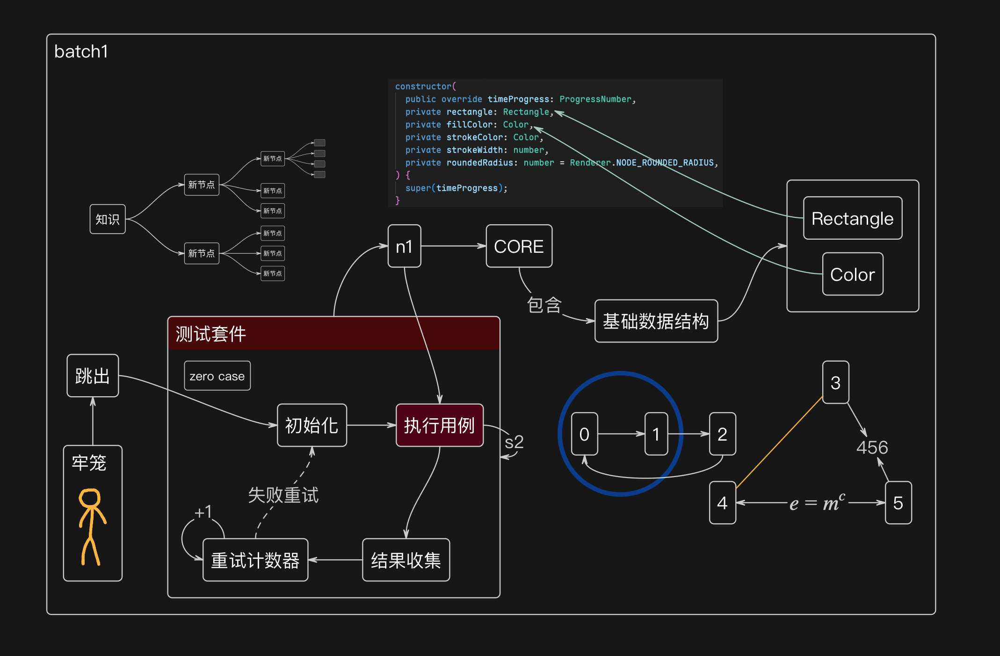

<h1>Project Graph</h1>

---

Project Graph 是一款功能丰富、高效易用的桌面级节点图绘制工具。它支持快速创建多种类型的图表，帮助用户在头脑风暴、教学设计、项目规划等场景中快速构思并直观呈现。

无论您是设计师、教师、还是开发人员，Project Graph 都能够为您提供简单流畅的用户体验。

## 🖼️ Demo

  

## 🌟 功能特点

- **直观的节点拖拽连接**：支持通过鼠标拖放快速创建、编辑和调整节点。
- **支持多种图表类型**：包括但不限于：
  - 有向无环图（DAG）
  - 树形结构图
  - 逻辑关系网络
- **历史记录功能**：撤销/重做每一步操作，完全无需担心出错。
- **自动保存和备份**：文档变更自动记录，避免数据丢失。
- **跨平台支持**：兼容 Windows、macOS 和大多数 Linux 系统。
- **现代界面设计**：支持多语言切换，包括完整中文界面。

此外，Project Graph 提供了丰富的扩展功能，并保持定期的功能更新。通过最新的 API 集成和优化，使其成为多场景下的最佳工具选择。

## 🛠 常见使用场景

Project Graph 非常适合以下用户和场景：

1. **设计师**：
   - 制作创意流程图。
   - 开展头脑风暴，生成关系图。

2. **教师**：
   - 开发课程大纲、知识图谱。
   - 准备课堂展示用的逻辑目录图。

3. **开发人员**：
   - 构建模块依赖图、工作流。
   - 分析系统架构与逻辑结构。

## 📥 安装步骤

您可以通过以下方式安装 Project Graph：

### 1. 直接下载

[前往官网](https://graphif.dev/release/latest) 下载适合您的平台的最新版本。

### 2. 从源代码构建

如果您希望了解项目内部原理，可以阅读 [开发指南](https://graphif.dev/docs/contribute) 来获取构建和开发的详细步骤。

## 🌎 社区与支持

欢迎 [加入我们的社区](https://graphif.dev/docs/prg/misc/community)，与更多开发者和用户互动交流。

## Sponsors

[慕乐云](https://muleyun.com/aff/HLONILNH)

[YXVM](https://yxvm.com/)

[ZMTO](https://console.zmto.com/?affid=1574)

[DartNode](https://dartnode.com)

